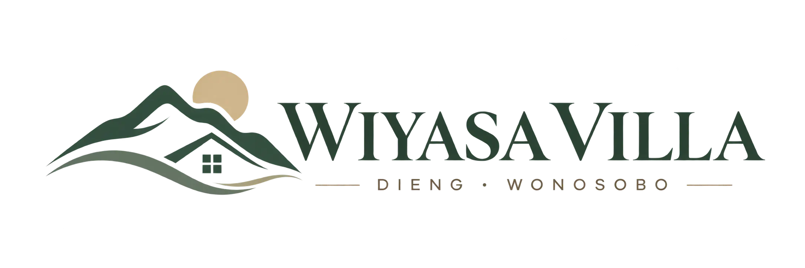

<p align="center">
  
</p>

<p align="center">
  Platform booking <strong>private cabin stay</strong> di Dieng, Wonosobo.
  Dibangun dengan fokus pada konsistensi booking, data-driven configuration, dan pengalaman pengguna.
</p>

<p align="center">
  <a href="https://laravel.com"></a>
  <a href="https://www.php.net"></a>
  <a href="https://inertiajs.com"></a>
  <a href="https://vuejs.org"></a>
  <a href="https://www.typescriptlang.org"></a>
  <a href="https://vitejs.dev"></a>
  <a href="https://tailwindcss.com"></a>
  <a href="https://www.postgresql.org"></a>
  <a href="https://redis.io"></a>
  <a href="https://www.docker.com"></a>
  
</p>

---

## 📖 Overview

**Wiyasa Villa** adalah platform booking **private cabin stay** di kawasan Dieng, Wonosobo — mencakup landing page marketing, catalog cabin, availability per malam, reservation dengan temporary hold, pembayaran Midtrans, invoice, QR check-in, hingga dashboard Admin dan Super Admin.

Proyek dibangun sebagai aplikasi full-stack yang realistis dan siap dikembangkan menuju production, sekaligus menjadi project portfolio. Seluruh aplikasi berbentuk **monolith Laravel + Inertia.js + Vue 3** yang berada di [`apps/web`](apps/web), dengan dokumentasi lengkap di [`docs/`](docs) dan aturan pengembangan di [`AGENTS.md`](AGENTS.md).

Dua prinsip utama:

- **Data-driven configuration** — cabin, kapasitas, fasilitas, pricing, season, voucher, hold duration, dan policy tidak di-hardcode, melainkan berasal dari database/admin.
- **Booking consistency** — satu cabin tidak boleh memiliki dua active reservation yang overlap. Pencegahan double booking mengandalkan database transaction, row lock pada cabin, availability re-check, dan idempotency — bukan availability check dari frontend.

## 🛠️ Tech Stack

### Application

| Technology | Deskripsi |
| :--------- | :-------- |
| [](https://laravel.com) | Framework backend — routing, ORM, queue, dan business logic. |
| [](https://www.php.net) | Bahasa pemrograman backend (PHP 8.3+). |
| [](https://inertiajs.com) | Bridge server-side Laravel ke Vue tanpa API terpisah. |
| [](https://laravel.com/docs/fortify) | Authentication untuk aplikasi. |

### Frontend

| Technology | Deskripsi |
| :--------- | :-------- |
| [](https://vuejs.org) | Library untuk membangun user interface. |
| [](https://www.typescriptlang.org) | Type-safe JavaScript untuk kode yang lebih aman. |
| [](https://vitejs.dev) | Build tool dan dev server. |
| [](https://tailwindcss.com) | Utility-first CSS framework. |
| [](https://reka-ui.com) | Headless component primitives. |
| [](https://vueuse.org) | Collection of composition utilities. |

### Data

| Technology | Deskripsi |
| :--------- | :-------- |
| [](https://www.postgresql.org) | Source of truth — inventory, reservation, transaksi. |
| [](https://redis.io) | Cache dan queue (bukan source of truth availability). |

### Development & Quality

| Technology | Deskripsi |
| :--------- | :-------- |
| [](https://www.docker.com) | Containerization — PostgreSQL, Redis, & Mailpit untuk development. |
| [](https://mailpit.axllent.org/) | Local email development & testing. |
| [](https://pestphp.com) | Test runner PHP. |
| [](https://phpstan.org) | Static analysis (Larastan). |
| [](https://laravel.com/docs/pint) | Code style checker (Laravel Pint). |

### External Services

| Technology | Deskripsi |
| :--------- | :-------- |
| [](https://midtrans.com) | Payment gateway — webhook-driven & idempotent. |
| [](https://developers.cloudflare.com/r2/) | Object storage S3-compatible untuk media. |

## 📁 Project Structure

```
wiyasa-villa/
├── apps/
│   └── web/              # Aplikasi utama — Laravel 13 + Inertia.js + Vue 3
├── packages/             # Workspace packages (reserved)
├── assets/               # Brand assets — logo & favicon
├── docs/                 # PRD, ERD, FLOWCHART, ARCHITECTURE, DESIGN
│   └── log/              # Change log per tugas (LOG-YYYYMMDD-slug)
├── infrastructure/
│   └── docker/           # Konfigurasi infrastruktur
├── test/                 # Test proyek tingkat repository (unit/feature/e2e)
├── .github/              # CI workflow, issue & PR templates
├── AGENTS.md             # Aturan kerja agent & quality gate
└── docker-compose.yml    # PostgreSQL 18 + Redis 7 + Mailpit (development)
```

> Tidak ada `apps/api` terpisah — backend dan frontend adalah satu aplikasi di `apps/web`.

## 🚀 Getting Started

Clone repository:

```bash
git clone git@github.com:kevinnazarr/wiyasa-villa.git
cd wiyasa-villa
```

Jalankan service development (Docker):

```bash
docker compose up -d
```

| Service | Address |
| ------- | ------- |
| PostgreSQL | `127.0.0.1:55432` (db: `db_wiyasa_villa`, user: `wiyasa`) |
| Redis | `127.0.0.1:56379` |
| Mailpit SMTP | `127.0.0.1:58025` |
| Mailpit UI | http://localhost:58081 |

### 💻 Aplikasi — `apps/web`

```bash
cd apps/web
composer install
cp .env.example .env
php artisan key:generate
php artisan migrate
composer run dev
```

Buka [http://localhost:8000](http://localhost:8000) di browser Anda.

> `.env.example` default memakai SQLite untuk setup instan. Untuk memakai PostgreSQL Docker di atas, sesuaikan konfigurasi `DB_*` di `.env` (host `127.0.0.1`, port `55432`).

### 🧰 Workspace scripts (dari repository root)

```bash
npm install
npm run dev        # dev server
npm run build      # production build
npm run lint       # code style check
npm run typecheck  # vue-tsc type check
```

### 🧪 Tests & quality checks

```bash
cd apps/web
composer test      # Pint + PHPStan (Larastan) + Pest
```

## 📚 Documentation

Dokumentasi lengkap project tersedia di [`docs/`](docs) — berisi PRD, data model, alur operasional, arsitektur, dan design system.

| Dokumen | Isi |
| ------- | --- |
| [`docs/PRD.md`](docs/PRD.md) | Requirements, business rules, scope, roadmap |
| [`docs/ERD.md`](docs/ERD.md) | Model data & relasi |
| [`docs/FLOWCHART.md`](docs/FLOWCHART.md) | Alur operasional & concurrency flow |
| [`docs/ARCHITECTURE.md`](docs/ARCHITECTURE.md) | Arsitektur teknis & prinsip |
| [`docs/DESIGN.md`](docs/DESIGN.md) | Design system & UI guidance |
| [`docs/log/`](docs/log/) | Change log per tugas code-changing |
| [`AGENTS.md`](AGENTS.md) | Workflow, quality gate, & aturan agent |

`README.md` ini hanyalah *entry point*. Seluruh keputusan arsitektur, requirement, dan standar pengembangan dijelaskan di dalam dokumentasi.

## 👤 Author

<div align="center">
  <a href="https://github.com/kevinnazarr">
    
  </a>
  <br><br>
  <a href="https://github.com/kevinnazarr">
    
  </a>
</div>

## 📄 License

> Belum ditentukan — project ini merupakan project portfolio / conceptual business system dan lisensi resmi belum ditetapkan.

---

<p align="center">
  Dibuat oleh <strong><a href="https://github.com/kevinnazarr">kevinnazarr</a></strong>
</p>
