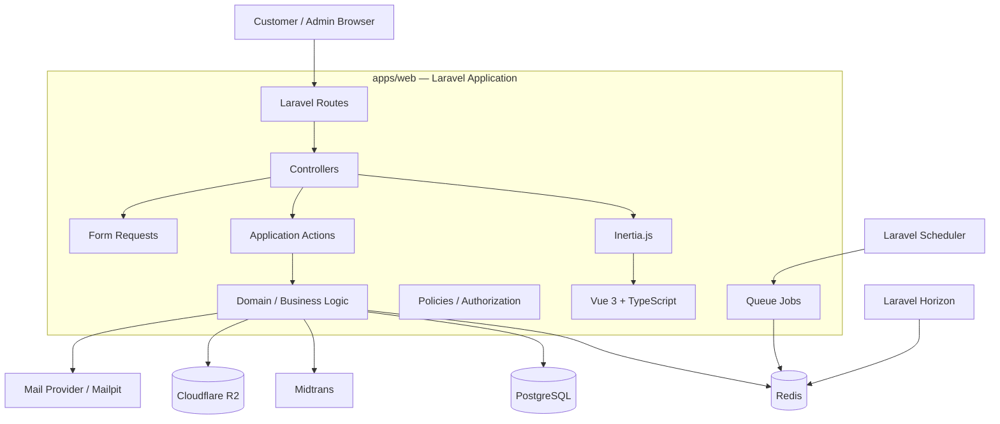
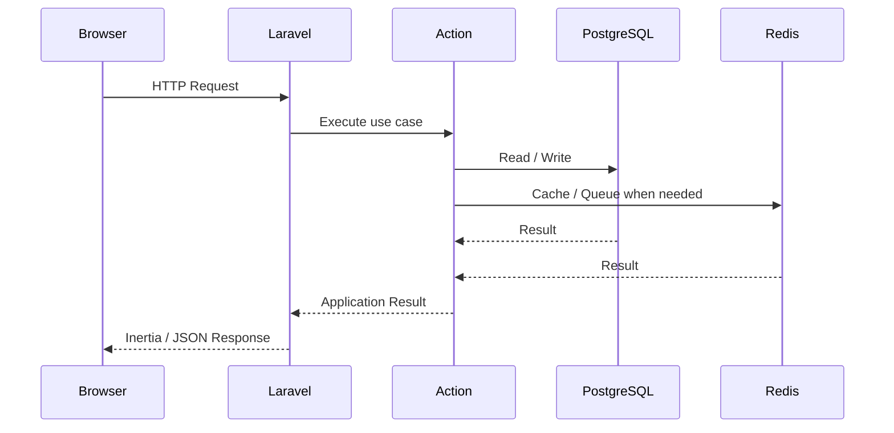
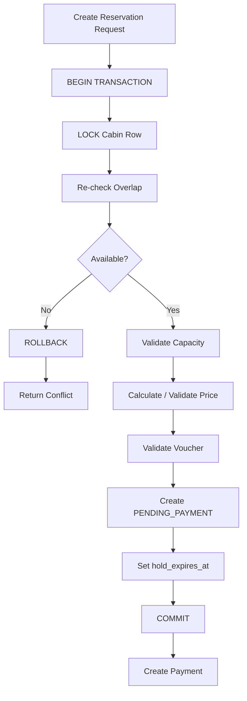
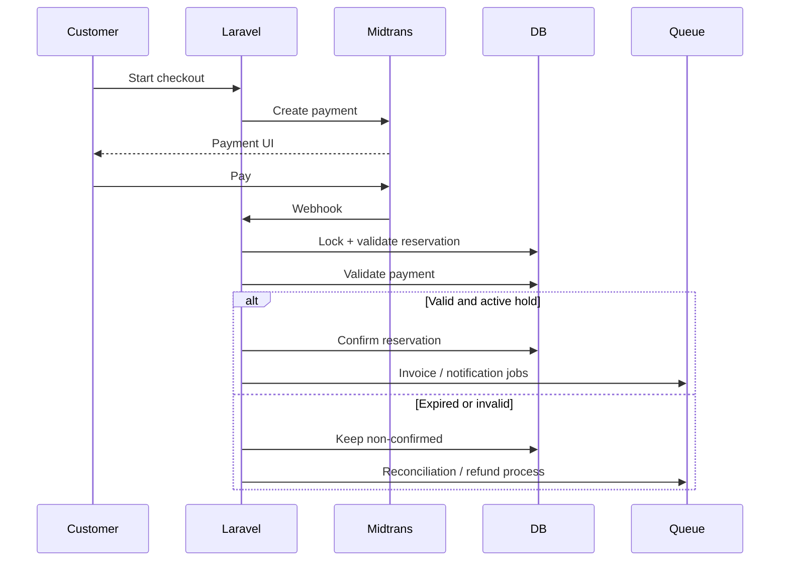
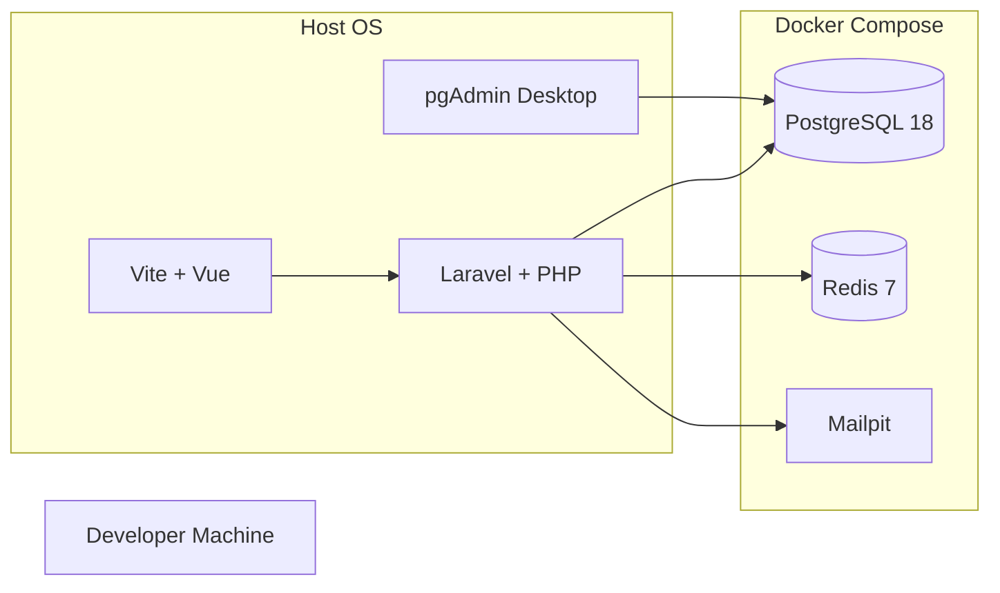
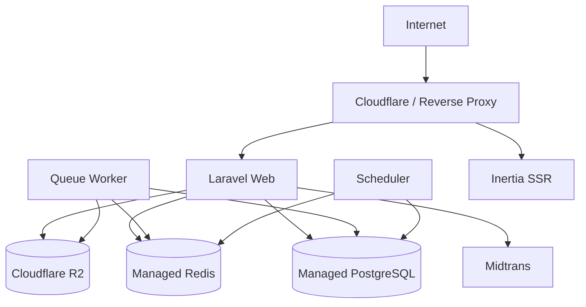
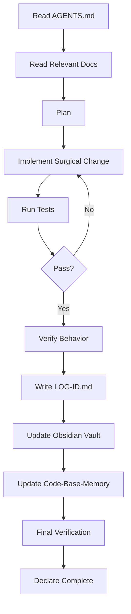

# Wiyasa Villa — Architecture Document

## 1. Purpose

Dokumen ini menjadi acuan arsitektur teknis Wiyasa Villa setelah PRD, ERD, dan FLOWCHART disepakati.

Arsitektur harus mengikuti:
- `PRD.md` sebagai sumber requirements dan business rules.
- `ERD.md` sebagai sumber model data.
- `FLOWCHART.md` sebagai sumber alur operasional dan concurrency flow.
- `AGENTS.md` sebagai aturan kerja agent dan quality gate.

---

## 2. Architecture Principles

### 2.1 PostgreSQL sebagai Source of Truth

PostgreSQL adalah source of truth untuk:
- cabin inventory;
- availability;
- reservation;
- payment records;
- invoice;
- voucher;
- customer;
- configuration bisnis.

Redis **bukan** source of truth availability.

### 2.2 Data-Driven Business Configuration

Data bisnis tidak boleh di-hardcode.

Contoh:
- cabin;
- kapasitas;
- fasilitas;
- harga;
- rate calendar;
- season;
- minimum stay;
- extra guest fee;
- hold duration;
- voucher;
- cancellation policy;
- booking policy;
- check-in/out policy.

Perubahan data tersebut harus dapat dilakukan melalui database/admin tanpa deployment ulang.

### 2.3 Backend Owns Business Rules

Frontend tidak menjadi sumber kebenaran untuk:
- availability;
- price;
- voucher;
- capacity;
- reservation state;
- payment state.

Frontend hanya membantu UX.

### 2.4 Atomic Reservation

Pembuatan temporary hold adalah operasi inventory-critical:

```text
BEGIN TRANSACTION
    LOCK CABIN
    RE-CHECK AVAILABILITY
    VALIDATE BUSINESS RULES
    CREATE HOLD
COMMIT
```

Availability check di UI tidak pernah menjadi reservation guarantee.

### 2.5 Idempotency

Operation berikut harus idempotent:
- reservation creation;
- payment webhook;
- confirmation;
- invoice generation;
- voucher redemption.

### 2.6 Immutable Transaction Snapshot

Setelah transaction terbentuk, nilai finansial menjadi snapshot:
- nightly rate;
- extra guest;
- voucher;
- discount;
- total.

Perubahan master pricing tidak mengubah transaksi lama.

---

## 3. High-Level Architecture

Wiyasa menggunakan **Laravel monolith + Inertia.js + Vue 3**.



---

## 4. Application Model

Wiyasa **tidak menggunakan `apps/api` secara terpisah** pada fase ini.

Repository menggunakan:

```text
apps/
└── web/
```

`apps/web` adalah satu Laravel application yang mencakup:
- backend;
- Inertia;
- Vue frontend;
- authentication;
- authorization;
- customer pages;
- admin pages;
- business logic;
- webhooks;
- queue jobs;
- scheduler.

### Request Flow



---

## 5. Repository / Monorepo

```text
wiyasa-villa/
├── AGENTS.md
├── package.json
├── package-lock.json
├── docker-compose.yml
│
├── apps/
│   └── web/
│       ├── app/
│       ├── bootstrap/
│       ├── config/
│       ├── database/
│       ├── public/
│       ├── resources/
│       │   ├── css/
│       │   └── js/
│       │       ├── Components/
│       │       ├── Layouts/
│       │       ├── Pages/
│       │       ├── Composables/
│       │       ├── Stores/
│       │       ├── Types/
│       │       └── app.ts
│       ├── routes/
│       ├── storage/
│       ├── tests/
│       ├── artisan
│       ├── composer.json
│       └── package.json
│
├── packages/
│   ├── ui/
│   ├── types/
│   └── config/
│
├── docs/
│   ├── PRD.md
│   ├── ERD.md
│   ├── FLOWCHART.md
│   ├── ARCHITECTURE.md
│   ├── log/
│   └── memory/
│
├── test/
└── infrastructure/
    └── docker/
```

### Monorepo Decision

Monorepo digunakan untuk:
- satu repository;
- shared UI;
- shared TypeScript types;
- shared tooling/config;
- satu CI workflow;
- satu development environment.

Monorepo tidak berarti harus banyak application. Saat ini satu `apps/web` sudah benar.

---

## 6. Frontend Architecture

### Stack

- Vue 3
- TypeScript
- Inertia.js
- Vite
- Tailwind CSS
- shadcn-vue / Reka UI
- Pinia
- TanStack Vue Query

### Inertia

Inertia menjadi navigation/data layer utama untuk first-party application.

Cocok untuk:
- public pages;
- customer pages;
- admin pages;
- forms;
- navigation.

### TanStack Vue Query

Dipakai selektif untuk server state yang membutuhkan:
- caching;
- refetch;
- invalidation;
- polling;
- asynchronous state.

Contoh:
- availability lookup;
- availability refresh;
- payment status;
- operational widgets.

TanStack Query tidak menjadi booking authority.

### Pinia

Dipakai untuk client/UI state:
- booking wizard UI state;
- sidebar;
- modal;
- UI preferences.

Pinia tidak menggantikan server state.

---

## 7. Backend Architecture

Baseline:

```text
HTTP / Inertia
      ↓
Controllers
      ↓
Form Requests
      ↓
Actions / Application Services
      ↓
Domain Logic
      ↓
Models / Services
      ↓
PostgreSQL / Redis / External Services
```

### Controllers

Controller harus tipis:
- menerima request;
- authorize;
- invoke action;
- response.

Business rule tidak diletakkan di controller.

### Actions

Use case penting dikelompokkan berdasarkan domain:

```text
Booking/
├── CreateReservation
├── VerifyAvailability
├── HoldCabin
├── ConfirmReservation
├── CancelReservation
└── ExpireReservation

Payment/
├── CreatePayment
└── HandleMidtransNotification

Voucher/
├── ValidateVoucher
├── ReserveVoucher
└── RedeemVoucher

CheckIn/
└── VerifyCheckIn
```

### Shared Booking Engine

Customer booking dan Admin manual booking harus menggunakan reservation engine yang sama.

---

## 8. Booking Architecture

### Reservation Lifecycle

```text
PENDING_PAYMENT
       │
       ├── payment success ──> CONFIRMED
       ├── payment failed ──> EXPIRED
       └── hold timeout ────> EXPIRED

CONFIRMED
       │
       ├── cancel ───────────> CANCELLED
       └── check-in ─────────> CHECKED_IN
                                  │
                                  └── COMPLETED
```

### Inventory States

```text
AVAILABLE
HELD
BOOKED
BLOCKED
```

### Active Reservation

Availability dianggap terblokir oleh:
- `PENDING_PAYMENT` + hold belum expired;
- `CONFIRMED`;
- `CHECKED_IN`.

Tidak aktif:
- `EXPIRED`;
- `CANCELLED`;
- `COMPLETED`.

---

## 9. Availability & Concurrency

Availability memiliki dua tingkat.

### Informational Availability

Untuk UX saat customer memilih tanggal.

Tidak menjamin slot.

### Authoritative Reservation

Dilakukan ketika hold dibuat:



### Double Booking Invariant

> Satu cabin tidak boleh memiliki lebih dari satu active reservation dengan interval menginap yang overlap.

### Locking Rule

Target lock adalah row cabin yang selalu ada.

Database lock harus sesingkat mungkin.

Payment gateway call tidak boleh dilakukan ketika cabin lock masih terbuka.

---

## 10. Payment Architecture

Payment bersifat asynchronous.



### Payment Source of Truth

Return/redirect customer bukan authoritative.

Verified Midtrans webhook menjadi source untuk payment state.

### Late Payment

```text
HOLD expired
    ↓
Reservation EXPIRED
    ↓
Payment SUCCESS terlambat
    ↓
Never auto-confirm
    ↓
Reconciliation / refund
```

---

## 11. Redis Architecture

Redis digunakan untuk:

```text
Cache
Queue
Session
Rate limiting bila diperlukan
```

Redis tidak digunakan sebagai authoritative availability store.

### Queue

Laravel Horizon digunakan untuk monitoring Redis queue.

Contoh jobs:
- expire reservation hold;
- generate invoice;
- generate QR;
- send booking email;
- payment notification;
- refund processing.

### Scheduler

Scheduler menangani cleanup/maintenance.

Correctness availability tidak boleh bergantung pada scheduler tepat waktu. `hold_expires_at` tetap diperiksa saat availability/reservation validation.

---

## 12. PostgreSQL Architecture

PostgreSQL digunakan untuk seluruh state bisnis yang membutuhkan consistency:

- users;
- roles/permissions;
- cabin inventory;
- pricing;
- reservation;
- payment;
- invoice;
- voucher;
- check-in;
- business configuration;
- audit.

### Database Guarantees

Gunakan:
- foreign keys;
- unique constraints;
- indexes;
- transactions;
- row-level locks;
- appropriate date/time types;
- database constraints where practical.

### Critical Transaction

Booking creation menggunakan:

```text
Transaction
+
Row Lock
+
Re-check
+
Write
+
Commit
```

---

## 13. Pricing Architecture

Harga dihitung per malam.

```text
12 Oct → rate A
13 Oct → rate B
14 Oct → rate B
```

Pricing engine memperhitungkan:
- cabin;
- nightly rate;
- season;
- minimum stay;
- guest count;
- extra guest;
- voucher;
- discount policy.

Saat hold dibuat, final price di-snapshot.

Master pricing dapat berubah tanpa memengaruhi reservation lama.

---

## 14. Voucher Architecture

Voucher dapat memiliki:
- validity;
- quota;
- per-customer limit;
- minimum transaction;
- percentage/fixed discount;
- maximum discount;
- cabin restriction;
- season restriction.

Voucher quota juga harus aman terhadap concurrency.

Concept:

```text
BEGIN TRANSACTION
    LOCK voucher/resource
    validate quota
    reserve usage
    create reservation
COMMIT
```

Hold expired melepaskan reserved usage yang belum redeemed.

---

## 15. Authentication & Authorization

### Authentication

Laravel built-in authentication / Fortify.

Satu authentication system untuk:
- Customer;
- Admin;
- Super Admin.

### Roles

```text
CUSTOMER
ADMIN
SUPER_ADMIN
```

### Authorization

Gunakan Laravel Policies/Gates dan role/permission layer.

Frontend route visibility bukan security boundary. Backend tetap wajib authorize.

---

## 16. Admin & Super Admin

Admin focus:

```text
Dashboard
Calendar
Customer
Reservation
Manual Booking
Payment
Invoice
Check-in
Voucher operational
```

Super Admin tambahan:

```text
Cabin configuration
Pricing
Rate calendar
Season
Voucher configuration
Booking policies
Cancellation policies
Admin management
System settings
Audit
```

Super Admin tetap tidak boleh merusak inventory consistency.

---

## 17. Manual Booking

Manual booking wajib melewati reservation engine yang sama:

```text
Admin
  ↓
Availability Validation
  ↓
LOCK CABIN
  ↓
Create Reservation
  ↓
Payment / Manual Payment
  ↓
Confirmed
```

Tidak boleh ada direct database insert yang bypass availability.

---

## 18. Cloudflare R2

R2 digunakan sebagai object storage untuk:

```text
cabins/
cabins/{cabin}/gallery/
branding/
invoices/
documents/
```

Database menyimpan metadata/object key, bukan binary image.

Local development dapat memakai local filesystem sebelum R2 credentials diaktifkan.

---

## 19. Midtrans Integration

Boundary:

```text
Laravel
   ↓
Midtrans
   ↓
Customer payment
   ↓
Verified webhook
   ↓
Payment action
```

Webhook handler harus:
- memvalidasi payment status;
- idempotent;
- menemukan transaction;
- lock reservation pada finalization;
- menghindari duplicate confirmation;
- menyimpan reference.

---

## 20. Local Development Architecture



### Local Ports

```text
Laravel HTTP : 8000
Vite         : 5173
PostgreSQL   : 55432
Redis        : 56379
Mailpit SMTP : 58025
Mailpit UI   : 58081
pgAdmin      : Desktop app
```

pgAdmin tidak dijalankan melalui Docker.

---

## 21. Production Direction

Production dapat memisahkan process:

```text
Web
Worker
Scheduler
Inertia SSR
```

Contoh:



Provider deployment dapat dipilih kemudian.

---

## 22. Security Architecture

Minimum baseline:

- secrets melalui environment/secret manager;
- `.env` tidak masuk Git;
- Form Request validation;
- backend authorization;
- password hashing;
- email verification;
- 2FA;
- password confirmation;
- CSRF protection;
- payment webhook verification;
- idempotency;
- audit trail;
- file upload validation;
- private/signed object access untuk sensitive files;
- rate limiting pada endpoint sensitif.

---

## 23. Testing Architecture

Testing layer:

### Unit
- pricing;
- voucher;
- policy;
- state transition.

### Feature
- authentication;
- reservation;
- manual booking;
- cancellation;
- payment webhook;
- check-in;
- voucher.

### Integration
- PostgreSQL;
- Redis;
- Midtrans boundary;
- R2 boundary.

### Concurrency
Wajib mencakup:

```text
Two customers
+
Same cabin
+
Same date range
+
Concurrent reservation
=
Exactly one successful hold
```

Tambahan:
- duplicate webhook;
- payment after hold expiry;
- cancellation/payment race;
- voucher quota race.

---

## 24. Agent & Project Memory Architecture

Project memory terdiri dari:

```text
AGENTS.md
    ↓
Agent behavior / rules

docs/log/
    ↓
Task change history

Obsidian Vault
    ↓
Human-maintained project memory

Code-Base-Memory MCP
    ↓
Codebase / agent memory
```

Completion gate:

```text
Implementation
+
Tests
+
Verification
+
LOG-ID.md
+
Relevant docs
+
Relevant memory updates
=
Done
```

---

## 25. Development Workflow



---

## 26. Explicitly Avoided Complexity

Untuk fase sekarang, Wiyasa tidak membutuhkan:

- separate `apps/api`;
- separate admin application;
- microservices;
- Kubernetes;
- dedicated booking microservice;
- Redis sebagai inventory source of truth;
- full event sourcing;
- full CQRS.

Semua dapat dipertimbangkan hanya jika ada kebutuhan nyata di masa depan.

---

## 27. Architecture Acceptance Criteria

Arsitektur foundation dianggap siap apabila:

- Laravel + Vue + Inertia berjalan;
- PostgreSQL terhubung;
- Redis terhubung;
- queue infrastructure tersedia;
- Mailpit tersedia untuk development;
- pgAdmin Desktop dapat mengakses PostgreSQL;
- authentication tersedia;
- PRD, ERD, FLOWCHART, dan ARCHITECTURE konsisten;
- reservation memakai transaction + locking;
- business configuration tidak hardcoded;
- concurrency test strategy tersedia;
- `AGENTS.md` menjadi development gate.
