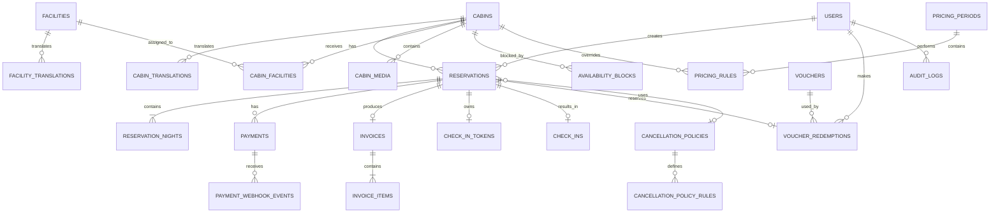

# ERD — Wiyasa Villa

**Document:** Entity Relationship Diagram  
**Version:** 1.1  
**Status:** Final Baseline  
**Database:** PostgreSQL  

---

## 1. Modeling Principles

ERD ini mengikuti prinsip berikut:

1. PostgreSQL adalah source of truth untuk inventory dan transaksi.
2. Business data tidak di-hardcode.
3. Reservation dan payment lifecycle dipisahkan.
4. Pricing master dipisahkan dari transaction snapshot.
5. Reservation night menyimpan nightly price snapshot.
6. Voucher usage dipisahkan agar quota dapat dikelola secara concurrency-safe.
7. Check-in/QR dipisahkan dari reservation state untuk auditability.
8. Availability block bukan booking.
9. Audit log menyimpan perubahan operasional penting.
10. Reservation creation menggunakan transaction + lock cabin.
11. PostgreSQL dapat menambahkan exclusion constraint untuk defense-in-depth terhadap overlap.
12. UI strings dan dynamic customer-facing content harus mendukung locale `id` dan `en`.
13. Locale preference user dipisahkan dari translation content; translation content menggunakan table per entity agar ter-normalisasi dan dapat diperluas.

---

## 2. High-Level ERD



---

## 3. Core Tables

### 3.1 `users`

Menyimpan customer dan user operasional.

| Column | Type | Notes |
|---|---|---|
| id | uuid | PK |
| role | enum | `CUSTOMER`, `ADMIN`, `SUPER_ADMIN` |
| name | varchar | Required |
| email | varchar | Nullable/unique sesuai policy |
| phone | varchar | Required untuk booking |
| password | varchar | Nullable jika future guest checkout diperbolehkan |
| locale | char(2) | `id` atau `en`; default `id` |
| is_active | boolean | Default true |
| email_verified_at | timestamp | Nullable |
| created_at | timestamp | |
| updated_at | timestamp | |

**Index:** `role`, `phone`, `email`, `locale`.

---

### 3.2 `cabins`

Inventory fisik yang dapat dibooking.

| Column | Type | Notes |
|---|---|---|
| id | bigint/uuid | PK |
| code | varchar | Unique, mis. `WY-01` |
| name | varchar | Internal/canonical name; customer-facing localization via `cabin_translations` |
| slug | varchar | Unique |
| description | text | Internal/admin fallback; customer-facing localization via `cabin_translations` |
| capacity | smallint | Data-driven; baseline 7 |
| base_occupancy | smallint | Baseline 4 |
| status | enum | `ACTIVE`, `INACTIVE`, `MAINTENANCE` |
| check_in_time | time | Optional override; default dari policy jika null |
| check_out_time | time | Optional override; default dari policy jika null |
| created_at | timestamp | |
| updated_at | timestamp | |

**Index:** `status`, `slug`.

### 3.2a `cabin_translations`

Menyimpan konten customer-facing cabin per locale.

| Column | Type | Notes |
|---|---|---|
| id | uuid | PK |
| cabin_id | FK | → cabins.id |
| locale | char(2) | `id` / `en` |
| name | varchar | Nama cabin pada locale tersebut |
| description | text | Deskripsi cabin pada locale tersebut |
| created_at | timestamp | |
| updated_at | timestamp | |

**Unique:** `(cabin_id, locale)`.

---

### 3.3 `facilities`

Master fasilitas yang reusable.

| Column | Type | Notes |
|---|---|---|
| id | bigint | PK |
| name | varchar | Mis. Water Heater |
| slug | varchar | Unique |
| description | text | Nullable |
| icon | varchar | Nullable |
| is_active | boolean | |
| created_at | timestamp | |
| updated_at | timestamp | |

### 3.3a `facility_translations`

Menyimpan label/deskripsi fasilitas per locale.

| Column | Type | Notes |
|---|---|---|
| id | uuid | PK |
| facility_id | FK | → facilities.id |
| locale | char(2) | `id` / `en` |
| name | varchar | Nama fasilitas pada locale tersebut |
| description | text | Deskripsi pada locale tersebut |
| created_at | timestamp | |
| updated_at | timestamp | |

**Unique:** `(facility_id, locale)`.

---

### 3.4 `cabin_facilities`

Pivot cabin ↔ facility.

| Column | Type | Notes |
|---|---|---|
| cabin_id | FK | → cabins.id |
| facility_id | FK | → facilities.id |
| sort_order | integer | Optional |
| created_at | timestamp | |

**PK:** `(cabin_id, facility_id)`.

---

### 3.5 `cabin_media`

Metadata object yang tersimpan di Cloudflare R2.

| Column | Type | Notes |
|---|---|---|
| id | uuid | PK |
| cabin_id | FK | → cabins.id |
| object_key | varchar | R2 key |
| media_type | enum | `IMAGE`, `VIDEO` jika dibutuhkan |
| mime_type | varchar | |
| alt_text | varchar | SEO/accessibility |
| sort_order | integer | |
| is_primary | boolean | Hero/cover |
| created_at | timestamp | |
| updated_at | timestamp | |

Tidak menyimpan binary media di PostgreSQL.

---

## 4. Pricing Tables

### 4.1 `pricing_periods`

Mendefinisikan periode normal/weekend/high season/special.

| Column | Type | Notes |
|---|---|---|
| id | bigint | PK |
| name | varchar | Mis. `Weekend`, `Peak New Year` |
| code | varchar | Unique |
| starts_on | date | |
| ends_on | date | Inclusive boundary pada level konfigurasi |
| priority | integer | Higher wins |
| is_active | boolean | |
| notes | text | Nullable |
| created_by | FK | → users.id |
| created_at | timestamp | |
| updated_at | timestamp | |

**Business rule:** Admin tidak boleh membuat rule aktif yang ambigu pada cabin/tanggal/day-of-week yang sama tanpa prioritas yang deterministic.

---

### 4.2 `pricing_rules`

Rule harga yang berlaku pada suatu period.

| Column | Type | Notes |
|---|---|---|
| id | bigint | PK |
| pricing_period_id | FK | → pricing_periods.id |
| cabin_id | FK | Nullable; null = global/default |
| day_of_week | smallint | Nullable; ISO 1–7 |
| nightly_rate | bigint | Rupiah dalam smallest unit yang disepakati |
| included_guests | smallint | |
| extra_guest_fee | bigint | Per guest/night |
| min_nights | smallint | |
| currency | char(3) | `IDR` |
| created_at | timestamp | |
| updated_at | timestamp | |

**Resolution idea:** cari semua rule yang cocok berdasarkan tanggal + cabin + day-of-week, lalu pilih priority tertinggi dan override cabin-specific bila ada.

---

## 5. Reservation Tables

### 5.1 `reservations`

Core inventory/booking record.

| Column | Type | Notes |
|---|---|---|
| id | uuid | PK |
| booking_code | varchar | Public unique identifier |
| user_id | FK | → users.id |
| cabin_id | FK | → cabins.id |
| locale | char(2) | Locale snapshot `id` / `en` untuk transactional communication |
| source | enum | `DIRECT_WEBSITE`, `ADMIN_MANUAL`, `OTHER` |
| status | enum | `PENDING_PAYMENT`, `CONFIRMED`, `EXPIRED`, `CANCELLED`, `CHECKED_IN`, `COMPLETED` |
| check_in_date | date | Inclusive |
| check_out_date | date | Exclusive boundary |
| adults | smallint | |
| children | smallint | |
| infants | smallint | |
| total_guests | smallint | Derived/snapshot |
| currency | char(3) | `IDR` |
| subtotal_amount | bigint | Snapshot |
| extra_guest_amount | bigint | Snapshot |
| discount_amount | bigint | Snapshot |
| total_amount | bigint | Snapshot |
| hold_expires_at | timestamp | Used for PENDING_PAYMENT |
| price_locked_at | timestamp | |
| cancellation_policy_id | FK | → cancellation_policies.id, nullable |
| cancelled_at | timestamp | Nullable |
| cancelled_by | FK | → users.id, nullable |
| cancellation_reason | text | Nullable |
| notes | text | Operational notes |
| created_at | timestamp | |
| updated_at | timestamp | |

### Critical constraints

- `check_out_date > check_in_date`.
- `total_guests = adults + children + infants`.
- `adults >= 0`, `children >= 0`, `infants >= 0`.
- Currency consistent with supported transaction currency.
- Booking code unique.

### Important index

```sql
INDEX reservations_cabin_dates_status
ON reservations (cabin_id, check_in_date, check_out_date, status);
```

---

### 5.2 `reservation_nights`

Snapshot harga per malam.

| Column | Type | Notes |
|---|---|---|
| id | bigint | PK |
| reservation_id | FK | → reservations.id |
| stay_date | date | One row per occupied night |
| nightly_rate | bigint | Snapshot |
| extra_guest_fee | bigint | Snapshot |
| nightly_subtotal | bigint | Calculated snapshot |
| created_at | timestamp | |

**Unique:** `(reservation_id, stay_date)`.

**Index:** `(stay_date, reservation_id)`.

---

## 6. Payment Tables

### 6.1 `payments`

Satu reservation dapat memiliki lebih dari satu payment attempt.

| Column | Type | Notes |
|---|---|---|
| id | uuid | PK |
| reservation_id | FK | → reservations.id |
| provider | varchar | `midtrans` |
| order_id | varchar | Unique per payment attempt |
| provider_transaction_id | varchar | Nullable until provider response; unique when present |
| status | enum | `PENDING`, `PAID`, `FAILED`, `EXPIRED`, `REFUND_PENDING`, `REFUNDED`, `PARTIALLY_REFUNDED` |
| amount | bigint | |
| currency | char(3) | |
| paid_at | timestamp | Nullable |
| expired_at | timestamp | Nullable |
| raw_response | jsonb | Sanitized provider response/audit payload |
| created_at | timestamp | |
| updated_at | timestamp | |

**Index:** `(reservation_id, status)`, unique `order_id`, unique provider transaction reference when present.

---

### 6.2 `payment_webhook_events`

Idempotency + audit untuk notification Midtrans.

| Column | Type | Notes |
|---|---|---|
| id | uuid | PK |
| payment_id | FK | → payments.id, nullable |
| provider | varchar | |
| event_id | varchar | Unique provider event/reference |
| provider_transaction_id | varchar | Nullable |
| event_type | varchar | |
| payload | jsonb | Sanitized payload |
| processing_status | enum | `RECEIVED`, `PROCESSED`, `FAILED` |
| processed_at | timestamp | Nullable |
| error_message | text | Nullable |
| created_at | timestamp | |
| updated_at | timestamp | |

**Critical constraint:** unique `(provider, event_id)`.

---

### 6.3 `refunds`

Refund transaction terpisah dari invoice.

| Column | Type | Notes |
|---|---|---|
| id | uuid | PK |
| payment_id | FK | → payments.id |
| reservation_id | FK | → reservations.id |
| amount | bigint | |
| reason | text | |
| status | enum | `PENDING`, `PROCESSING`, `COMPLETED`, `FAILED` |
| provider_refund_id | varchar | Nullable/unique |
| initiated_by | FK | → users.id, nullable |
| processed_at | timestamp | Nullable |
| created_at | timestamp | |
| updated_at | timestamp | |

---

## 7. Voucher Tables

### 7.1 `vouchers`

| Column | Type | Notes |
|---|---|---|
| id | bigint | PK |
| code | varchar | Unique |
| discount_type | enum | `PERCENTAGE`, `FIXED` |
| discount_value | bigint | Percentage in basis points or integer percentage according to implementation convention |
| max_discount_amount | bigint | Nullable |
| min_transaction_amount | bigint | Nullable |
| valid_from | timestamp | |
| valid_until | timestamp | |
| usage_limit | integer | Nullable = unlimited |
| per_customer_limit | integer | Nullable = unlimited |
| is_active | boolean | |
| created_by | FK | → users.id |
| created_at | timestamp | |
| updated_at | timestamp | |

### 7.2 `voucher_cabins`

| Column | Type |
|---|---|
| voucher_id | FK |
| cabin_id | FK |

**PK:** `(voucher_id, cabin_id)`.

### 7.3 `voucher_pricing_periods`

| Column | Type |
|---|---|
| voucher_id | FK |
| pricing_period_id | FK |

**PK:** `(voucher_id, pricing_period_id)`.

### 7.4 `voucher_redemptions`

Tracks quota reservation/redeemed/released.

| Column | Type | Notes |
|---|---|---|
| id | uuid | PK |
| voucher_id | FK | → vouchers.id |
| reservation_id | FK | → reservations.id |
| user_id | FK | → users.id |
| status | enum | `RESERVED`, `REDEEMED`, `RELEASED` |
| discount_amount | bigint | Snapshot |
| reserved_at | timestamp | |
| redeemed_at | timestamp | Nullable |
| released_at | timestamp | Nullable |
| created_at | timestamp | |
| updated_at | timestamp | |

**Unique:** `(voucher_id, reservation_id)`.

---

## 8. Cancellation Policy Tables

### 8.1 `cancellation_policies`

| Column | Type |
|---|---|
| id | bigint |
| name | varchar |
| code | varchar unique |
| is_active | boolean |
| priority | integer |
| created_by | FK |
| created_at | timestamp |
| updated_at | timestamp |

### 8.2 `cancellation_policy_rules`

| Column | Type | Notes |
|---|---|---|
| id | bigint | PK |
| cancellation_policy_id | FK | |
| min_days_before | integer | Inclusive |
| max_days_before | integer | Nullable = no upper bound |
| refund_percentage | numeric(5,2) | 0–100 |
| created_at | timestamp | |
| updated_at | timestamp | |

No-show can be modeled as a dedicated rule/condition in the policy service or by a special rule type if needed.

---

## 9. Check-in Tables

### 9.1 `check_in_tokens`

QR verification token metadata.

| Column | Type | Notes |
|---|---|---|
| id | uuid | PK |
| reservation_id | FK unique | → reservations.id |
| token_hash | varchar | Store hash, not raw secret token |
| issued_at | timestamp | |
| expires_at | timestamp | Nullable |
| used_at | timestamp | Nullable |
| revoked_at | timestamp | Nullable |
| created_at | timestamp | |
| updated_at | timestamp | |

### 9.2 `check_ins`

| Column | Type | Notes |
|---|---|---|
| id | uuid | PK |
| reservation_id | FK unique | → reservations.id |
| verified_by_user_id | FK | → users.id |
| verified_at | timestamp | |
| notes | text | Nullable |
| created_at | timestamp | |
| updated_at | timestamp | |

---

## 10. Availability Block

### `availability_blocks`

| Column | Type | Notes |
|---|---|---|
| id | uuid | PK |
| cabin_id | FK | → cabins.id |
| start_date | date | Inclusive |
| end_date | date | Exclusive |
| block_type | enum | `MAINTENANCE`, `PRIVATE_USE`, `OTHER` |
| reason | text | Required |
| created_by | FK | → users.id |
| starts_at | timestamp | Audit timestamp |
| ends_at | timestamp | Nullable for audit, not date range |
| created_at | timestamp | |
| updated_at | timestamp | |

**Constraint:** `end_date > start_date`.

---

## 11. Invoice Tables

### 11.1 `invoices`

Financial snapshot header.

| Column | Type | Notes |
|---|---|---|
| id | uuid | PK |
| invoice_number | varchar | Unique |
| reservation_id | FK unique | → reservations.id |
| user_id | FK | → users.id |
| cabin_id | FK | → cabins.id |
| status | enum | `ISSUED`, `VOID` |
| currency | char(3) | |
| customer_name_snapshot | varchar | Immutable snapshot |
| customer_email_snapshot | varchar | Nullable |
| customer_phone_snapshot | varchar | |
| cabin_name_snapshot | varchar | |
| check_in_date_snapshot | date | |
| check_out_date_snapshot | date | |
| subtotal_amount | bigint | |
| discount_amount | bigint | |
| total_amount | bigint | |
| issued_at | timestamp | |
| created_at | timestamp | |
| updated_at | timestamp | |

### 11.2 `invoice_items`

| Column | Type |
|---|---|
| id | uuid |
| invoice_id | FK |
| item_type | varchar |
| description | varchar |
| quantity | numeric(10,2) |
| unit_amount | bigint |
| total_amount | bigint |
| metadata | jsonb nullable |
| created_at | timestamp |
| updated_at | timestamp |

---

## 12. System Configuration

### `system_settings`

Untuk business settings yang bersifat configurable.

| Column | Type | Notes |
|---|---|---|
| id | bigint | PK |
| key | varchar | Unique |
| value | jsonb | Typed value stored as JSON |
| group | varchar | Mis. `booking`, `payment`, `check_in` |
| description | text | |
| is_public | boolean | Hanya setting tertentu yang boleh dikirim ke frontend |
| updated_by | FK | → users.id |
| created_at | timestamp | |
| updated_at | timestamp | |

Contoh keys:

```text
booking.default_hold_minutes
booking.default_check_in_time
booking.default_check_out_time
booking.default_minimum_nights
booking.infant_max_age
```

Harga cabin **tidak** disimpan sebagai system setting; harga berada di pricing tables.

---

## 13. Audit Logs

### `audit_logs`

| Column | Type | Notes |
|---|---|---|
| id | uuid | PK |
| actor_user_id | FK | → users.id |
| action | varchar | Mis. `reservation.cancelled` |
| auditable_type | varchar | Polymorphic type |
| auditable_id | uuid/bigint | Polymorphic ID |
| before | jsonb | Nullable |
| after | jsonb | Nullable |
| reason | text | Nullable |
| ip_address | inet | Nullable |
| user_agent | text | Nullable |
| created_at | timestamp | |

---

## 14. Important Relationships

### User → Locale

`users.locale` menyimpan preferensi bahasa user terautentikasi (`id` / `en`). Guest menggunakan session/cookie.

### Cabin → Translation

`cabin_translations` menyimpan nama/deskripsi customer-facing per locale.

### Facility → Translation

`facility_translations` menyimpan nama/deskripsi fasilitas per locale.

### Reservation → Locale

`reservations.locale` adalah snapshot locale pada saat reservation dibuat sehingga komunikasi/transaksi historis tetap konsisten.

### Customer → Reservation

```text
users 1 --- N reservations
```

### Cabin → Reservation

```text
cabins 1 --- N reservations
```

### Reservation → Nights

```text
reservation 1 --- N reservation_nights
```

Satu reservation 2 malam menghasilkan dua row `reservation_nights`.

### Reservation → Payment

```text
reservation 1 --- N payments
```

Diperlukan karena satu reservation dapat memiliki payment retry.

### Reservation → Invoice

```text
reservation 1 --- 0..1 invoice
```

Invoice hanya dibuat setelah confirmed.

### Reservation → QR Token

```text
reservation 1 --- 0..1 check_in_token
```

### Reservation → Check-in

```text
reservation 1 --- 0..1 check_in
```

---

## 15. Double Booking Database Strategy

### Layer 1 — Cabin row lock

Reservation creation:

```sql
BEGIN;

SELECT *
FROM cabins
WHERE id = :cabin_id
FOR UPDATE;

-- expire stale holds
-- check availability blocks
-- check active reservation overlap
-- insert new reservation

COMMIT;
```

### Layer 2 — Overlap query

```sql
WHERE cabin_id = :cabin_id
AND check_in_date < :requested_check_out
AND check_out_date > :requested_check_in
AND (
    status = 'CONFIRMED'
    OR status = 'CHECKED_IN'
    OR (
        status = 'PENDING_PAYMENT'
        AND hold_expires_at > NOW()
    )
)
```

### Layer 3 — PostgreSQL exclusion constraint

Untuk produksi, pertimbangkan constraint seperti berikut setelah `btree_gist` tersedia dan lifecycle expired hold ditangani dalam transaction:

```sql
CREATE EXTENSION IF NOT EXISTS btree_gist;

ALTER TABLE reservations
ADD CONSTRAINT reservations_no_overlap
EXCLUDE USING gist (
    cabin_id WITH =,
    daterange(check_in_date, check_out_date, '[)') WITH &&
)
WHERE (
    status IN ('PENDING_PAYMENT', 'CONFIRMED', 'CHECKED_IN')
);
```

**Catatan:** predicate tidak boleh bergantung pada `NOW()` karena constraint predicate harus immutable. Oleh karena itu stale `PENDING_PAYMENT` harus dinormalisasi/expired lebih dulu di dalam transaction booking.

---

## 16. Recommended Indexes

Minimal:

```text
users(email)
users(phone)

cabins(slug)
cabins(status)

reservations(booking_code)
reservations(cabin_id, check_in_date, check_out_date, status)
reservations(user_id, created_at)

reservation_nights(reservation_id, stay_date)
reservation_nights(stay_date)

payments(order_id)
payments(provider_transaction_id)
payments(reservation_id, status)

payment_webhook_events(provider, event_id)

vouchers(code)
voucher_redemptions(voucher_id, status)
voucher_redemptions(user_id, voucher_id)

availability_blocks(cabin_id, start_date, end_date)

invoices(invoice_number)
invoices(reservation_id)

audit_logs(actor_user_id, created_at)
audit_logs(auditable_type, auditable_id)
```

---

## 17. State Relationships

### Reservation

```text
PENDING_PAYMENT
    ├── payment success + final validation ──> CONFIRMED
    ├── hold timeout ------------------------> EXPIRED
    ├── payment failed ----------------------> EXPIRED
    └── cancellation before confirmation ---> CANCELLED (optional operational flow)

CONFIRMED
    ├── check-in ----------------------------> CHECKED_IN
    └── cancellation ------------------------> CANCELLED

CHECKED_IN
    └── stay finished -----------------------> COMPLETED
```

### Payment

```text
PENDING
  ├── success --> PAID
  ├── fail ----> FAILED
  └── timeout -> EXPIRED

PAID
  ├── full refund ----> REFUNDED
  └── partial refund -> PARTIALLY_REFUNDED
```

---

## 18. Data Integrity Rules

- Foreign keys wajib digunakan.
- Monetary amounts menggunakan integer smallest unit Rupiah, bukan float.
- Date range menggunakan `[start, end)`.
- Invoice/payment transaction tidak boleh diubah dengan cara overwrite histori.
- Cancellation menghasilkan record/state history/audit.
- Semua provider IDs yang memang unique harus diberi unique index.
- Webhook event harus idempotent.
- Booking status transitions harus divalidasi di application service.
- Business data tidak boleh tersebar sebagai magic number di frontend/backend.
- Locale hanya boleh berasal dari whitelist aplikasi: `id`, `en`.
- Untuk setiap cabin/facility yang tampil ke customer, translation record minimal tersedia untuk locale utama `id`; locale `en` wajib tersedia untuk baseline multi-bahasa.
- User-facing UI text tidak boleh bergantung pada raw string yang tidak memiliki translation key.

---

## 19. Future-safe but Not Required

ERD dapat diperluas untuk:

- channel OTA;
- breakfast/add-ons;
- multiple payment methods;
- multiple locations;
- dynamic tax/fee;
- reporting warehouse.

Tetapi tabel-tabel tersebut tidak perlu dibuat sebelum requirement nyata muncul.
