# FLOWCHART — Wiyasa Villa

**Document:** Business & Technical Flowchart  
**Version:** 1.1  
**Status:** Final Baseline  

Dokumen ini menggambarkan alur customer, reservation concurrency, payment, cancellation, admin manual booking, pricing/voucher, check-in, dan locale/i18n.

---

## 1. Customer Booking — End-to-End

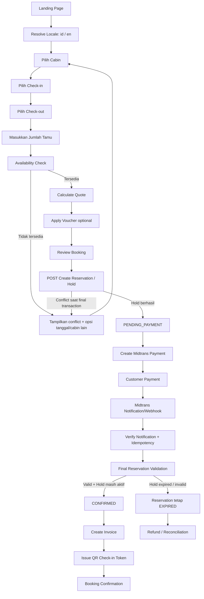

---

## 2. Availability Check vs Reservation Authority

Poin utama sistem:

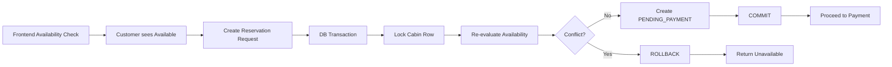

**Kesimpulan:** hasil `Availability Check` tidak pernah menjadi lock. Lock terjadi hanya ketika backend membuat reservation.

---

## 3. Concurrent Booking — Customer A vs Customer B

Skenario: dua customer memilih cabin dan tanggal yang sama hampir bersamaan.

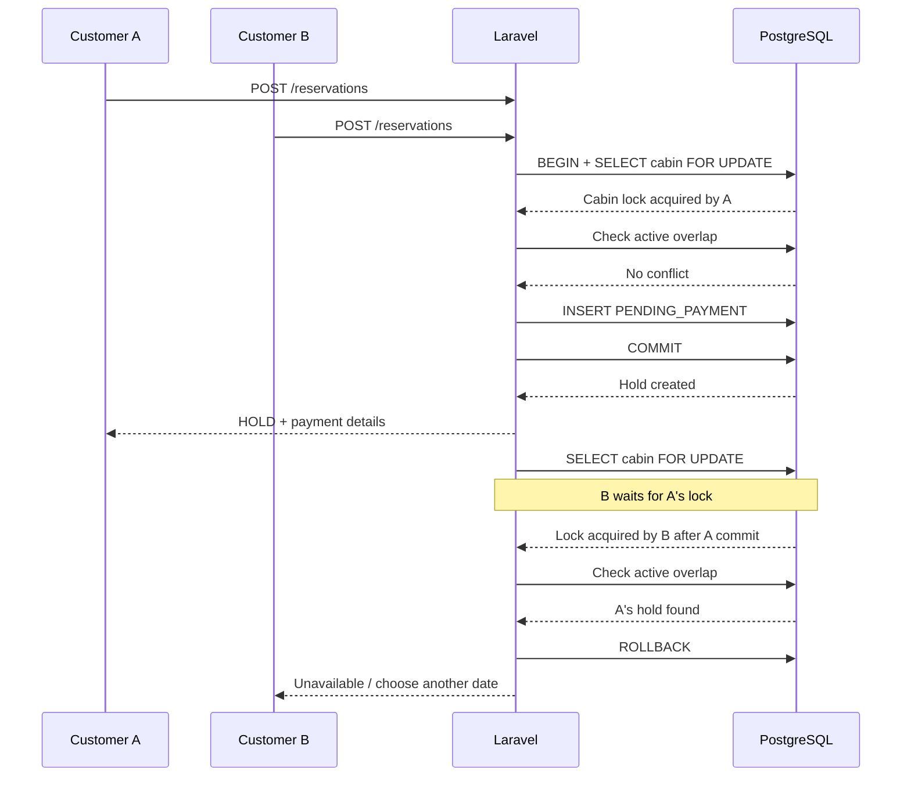

### Invariant

```text
At most one active overlapping reservation per cabin.
```

---

## 4. Reservation Hold State

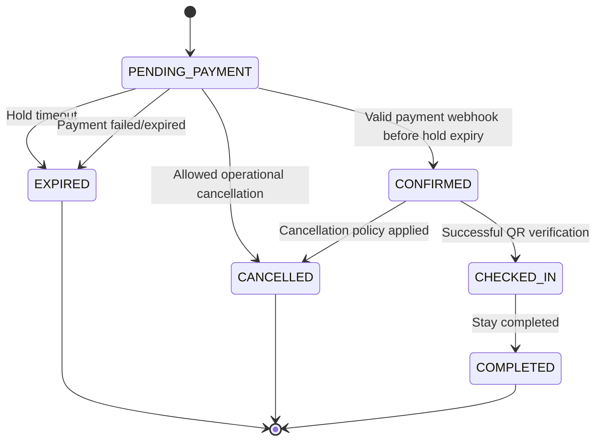

---

## 5. Hold Expiration

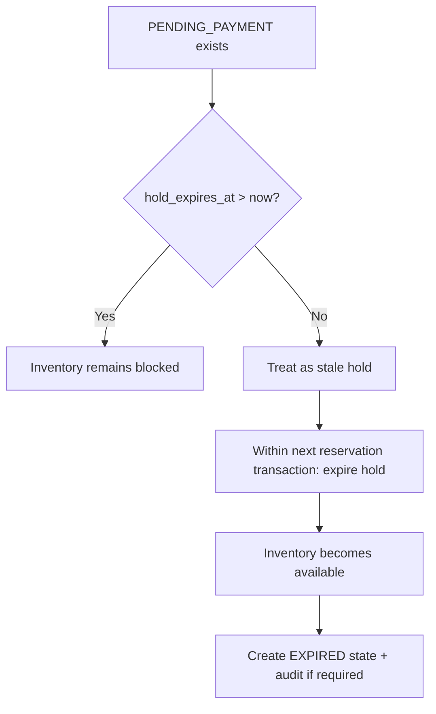

Scheduler/queue digunakan untuk cleanup, tetapi availability correctness tidak bergantung pada scheduler tepat waktu.

---

## 6. Payment Webhook Flow

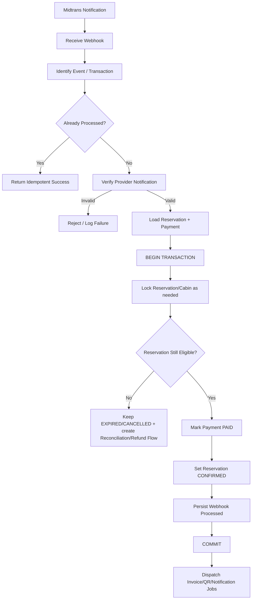

---

## 7. Late Payment After Hold Expired

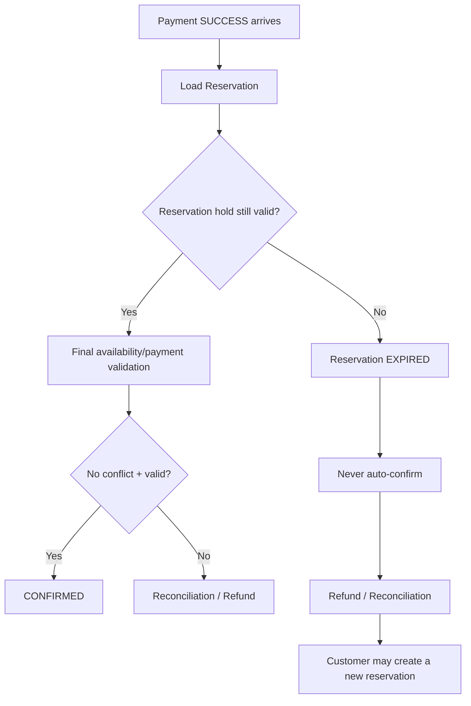

---

## 8. Payment Failure

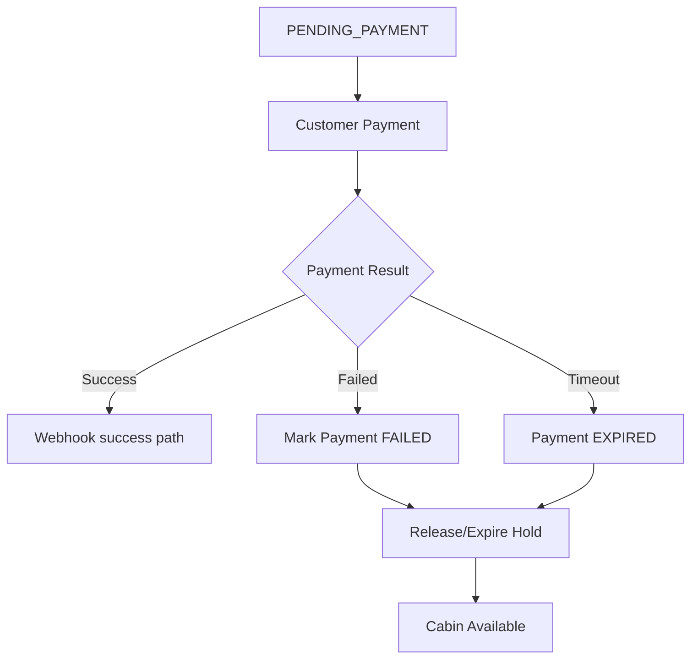

---

## 9. Pricing Calculation Flow

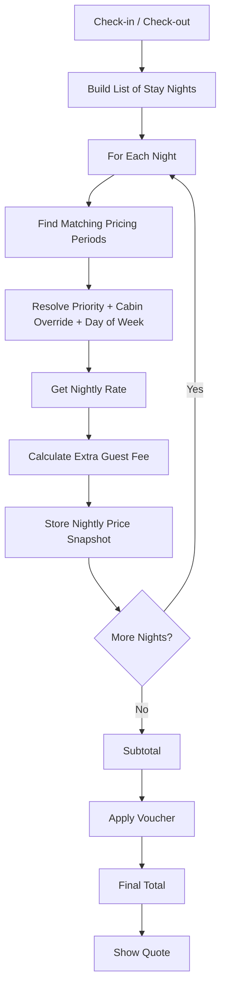

---

## 10. Voucher Concurrency Flow

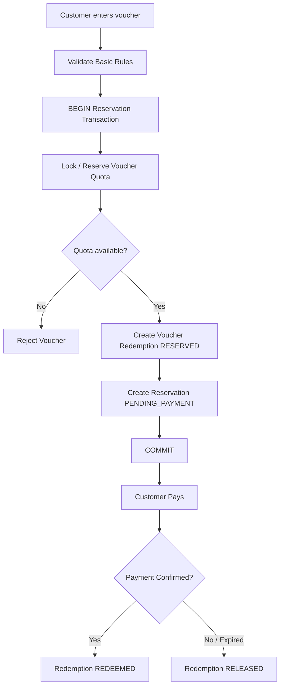

---

## 11. Admin Manual Booking

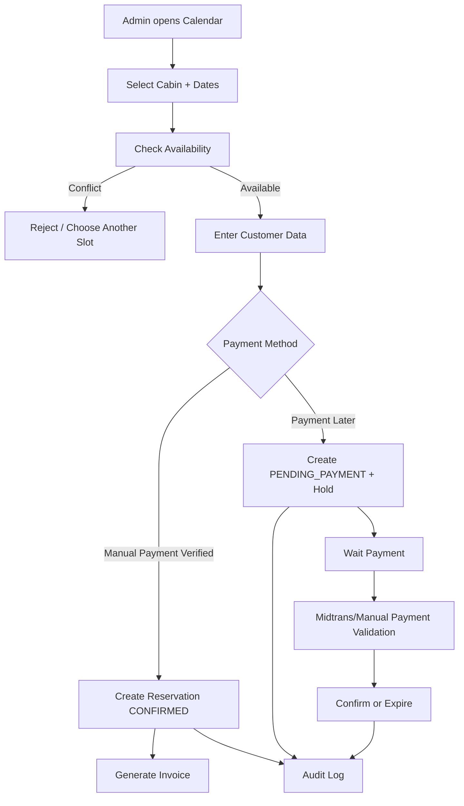

**Important:** Admin manual booking menggunakan engine availability yang sama. Tidak boleh ada jalur `direct insert without validation`.

---

## 12. Cancellation Flow

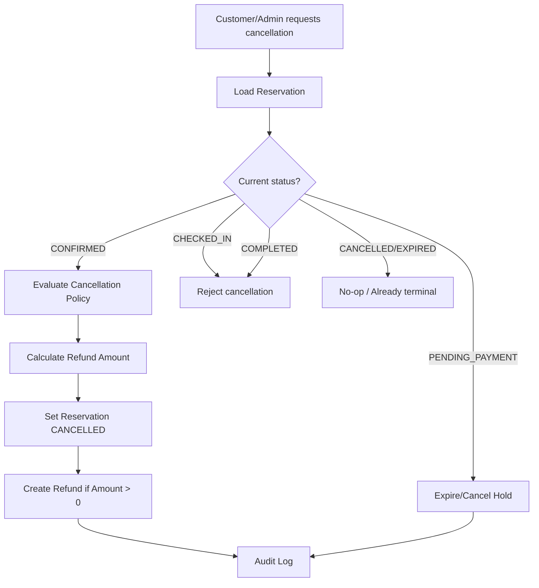

---

## 13. QR Check-in Flow

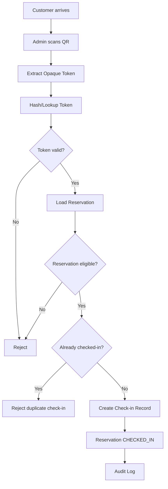

---

## 14. Availability Rules

### Requested range

```text
requested_start = check_in_date
requested_end   = check_out_date
```

### Existing booking overlaps if

```text
existing_start < requested_end
AND
existing_end > requested_start
```

### Active condition

```text
CONFIRMED
OR CHECKED_IN
OR (
    PENDING_PAYMENT
    AND hold_expires_at > now
)
```

### Additional blockers

```text
availability_blocks
```

juga dianggap unavailable.

---

## 15. State Machine Summary

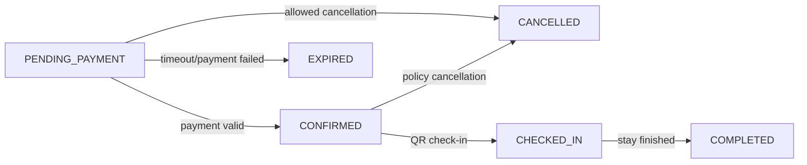

---

## 16. Background Jobs

Background processing yang direkomendasikan:

```text
ExpireStaleReservationsJob
ProcessMidtransNotificationJob
GenerateInvoiceJob
GenerateCheckInTokenJob
SendBookingConfirmationJob
SendPaymentFailureNotificationJob
ProcessRefundJob
CleanupTemporaryFilesJob
```

### Scheduler rule

Scheduler membantu cleanup, tetapi bukan sumber kebenaran availability.

Contoh:

```text
Every minute
→ Find stale PENDING_PAYMENT
→ Mark EXPIRED
→ Release voucher reservations
```

Jika scheduler terlambat, transaction booking berikutnya tetap harus dapat expire stale hold secara on-demand.

---

## 17. Operational Calendar Flow

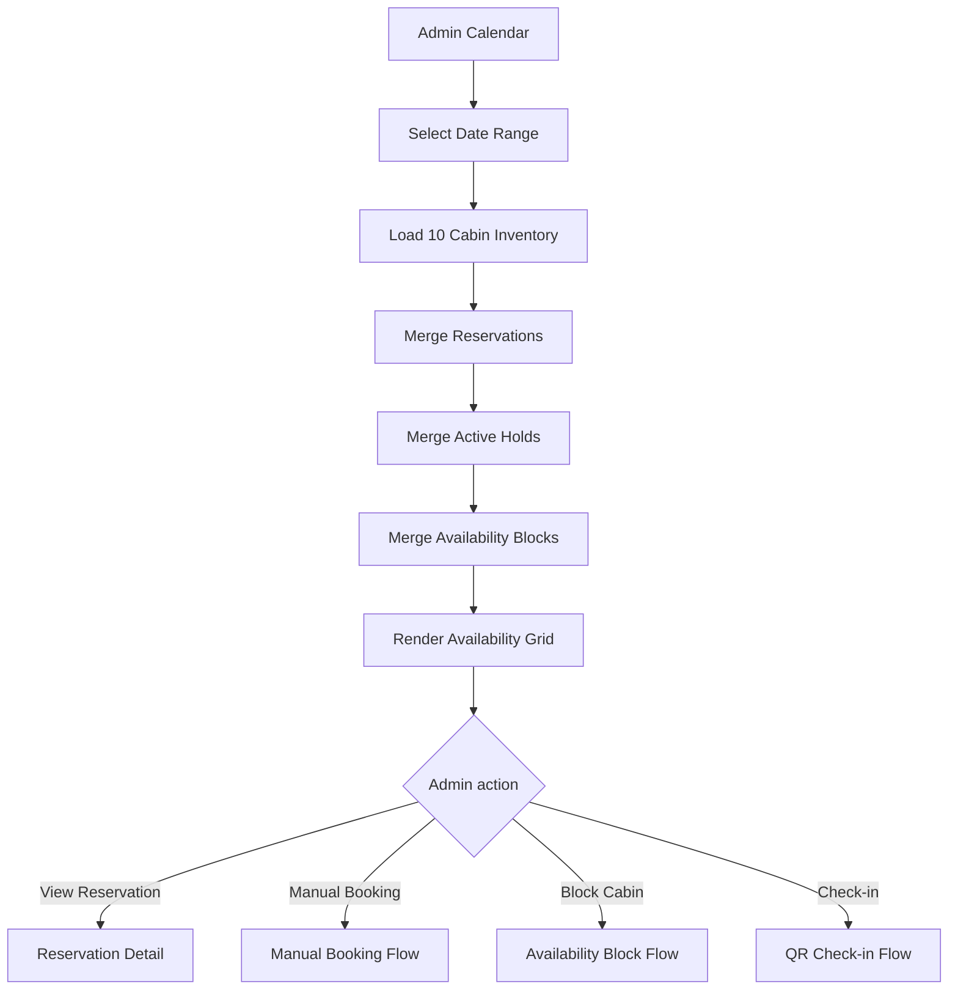

---

## 18. Business Data Flow

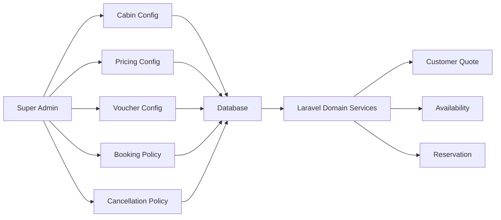

Prinsipnya: business configuration dibaca dari database/configuration layer, bukan dari hardcoded frontend/backend constants.

---

## 19. Final Flow Principle

Wiyasa memiliki dua tahap yang berbeda:

```text
DISCOVERY
→ availability check
→ quote

COMMITMENT
→ transaction
→ cabin lock
→ re-check
→ hold
→ payment
→ final validation
→ confirmed
```

**Tidak ada flow yang boleh melompati tahap commitment dan langsung mengubah inventory.**
## 20. Internationalization / Locale Resolution Flow

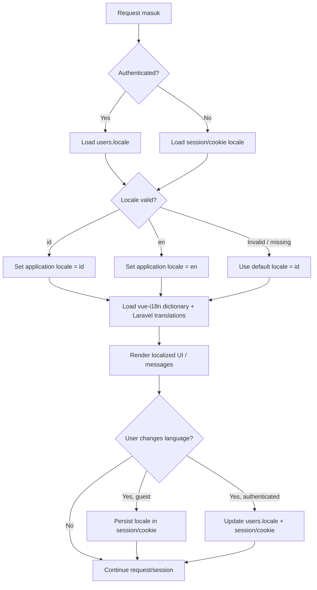

### i18n rules

- Supported locales pada baseline: `id` dan `en`.
- Default locale: `id`. Fallback locale: `en`.
- UI string menggunakan translation key melalui `vue-i18n`.
- Validation/notification/server-side messages menggunakan Laravel localization.
- Dynamic cabin/facility content menggunakan translation tables sesuai locale aktif.
- `reservations.locale` menyimpan snapshot locale pada saat reservation dibuat.
- Perubahan locale tidak boleh mengubah availability, pricing, payment state, atau business rules.

---

