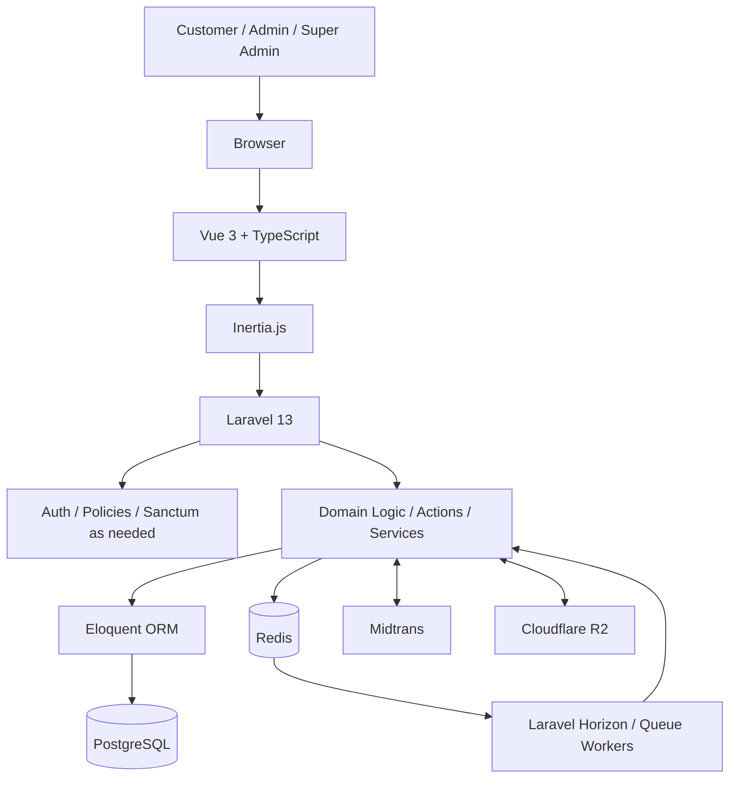
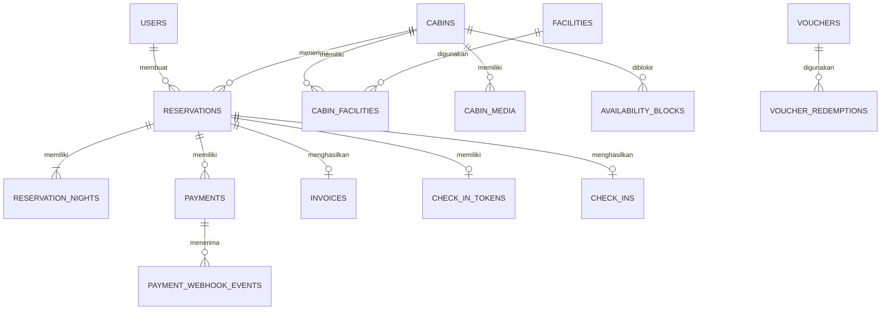

# PRD — Project Requirements Document
**Wiyasa Villa — Premium Private Cabin Stay in Dieng, Wonosobo**

**Version:** 1.1  
**Status:** Final Baseline  
**Audience:** Product, Design, Frontend, Backend, QA, DevOps

---

## 1. Overview

Wiyasa Villa adalah konsep website booking untuk bisnis **private cabin stay** di kawasan Dieng, Wonosobo. Produk dirancang sebagai portfolio full-stack yang realistis dan production-oriented, dengan 10 cabin pada baseline awal dan kapasitas maksimal 7 tamu per cabin.

Masalah utama yang ingin diselesaikan adalah kebutuhan customer untuk menemukan cabin, melihat ketersediaan tanggal menginap, menghitung harga, melakukan booking dan pembayaran secara online, lalu menerima bukti booking yang dapat digunakan saat check-in. Dari sisi operasional, sistem harus mencegah double booking walaupun beberapa customer melakukan reservasi pada cabin dan tanggal yang sama secara bersamaan.

Aplikasi ini menyediakan landing page untuk pemasaran cabin, booking engine berbasis malam, availability engine yang concurrency-safe, temporary reservation/hold, pembayaran melalui Midtrans, invoice, QR check-in, serta dashboard Admin dan Super Admin. Seluruh data bisnis seperti cabin, kapasitas, fasilitas, harga, season, voucher, hold duration, jam check-in/out, minimum stay, dan cancellation policy harus bersifat **data-driven** dan dapat diubah melalui database/admin tanpa mengubah source code.

---

## 2. Requirements

- Aplikasi berbentuk web full-stack untuk pemasaran, booking, pembayaran, invoice, dan verifikasi check-in.
- Customer dapat melihat daftar cabin, detail cabin, fasilitas, kapasitas, foto, harga, dan availability.
- Booking menggunakan model **per malam** dengan `check_in` dan `check_out`, bukan booking per jam.
- Sistem harus melakukan availability check berdasarkan cabin dan rentang tanggal.
- Availability check hanya untuk UX; reservation authority terjadi ketika backend berhasil membuat temporary hold secara atomik.
- Sistem harus mencegah double booking dengan database transaction, row lock pada cabin, overlap validation, dan idempotency.
- `PENDING_PAYMENT` dengan hold yang masih aktif harus memblokir inventory cabin.
- Pembayaran dilakukan melalui Midtrans dan konfirmasi booking hanya dilakukan berdasarkan webhook/notification yang tervalidasi serta final validation di backend.
- Payment lifecycle dan booking lifecycle harus dipisahkan.
- Sistem harus menghasilkan invoice setelah reservation menjadi `CONFIRMED`.
- Sistem harus menyediakan QR token untuk verifikasi check-in.
- Admin dapat melakukan manual booking tetapi tidak boleh melewati availability engine.
- Super Admin dapat mengelola konfigurasi bisnis dan sistem, tetapi tidak boleh membuat reservation aktif yang overlap hanya melalui override manual.
- Sistem mendukung pricing weekday, weekend, peak/special period, minimum stay, base occupancy, dan extra guest fee.
- Sistem mendukung voucher dengan quota, masa berlaku, batas transaksi, dan redemption concurrency-safe.
- Sistem mendukung cancellation, refund, availability block, dan audit trail.
- Data cabin, harga, fasilitas, season, voucher, policy, dan konfigurasi operasional tidak boleh di-hardcode.
- Aplikasi dikembangkan bertahap dalam **4 fase** pada roadmap.

### Prinsip data-driven

Nilai seperti berikut adalah **business data/configuration**, bukan hardcoded application constants:

- jumlah cabin awal: 10;
- kapasitas maksimal cabin: 7 tamu;
- base occupancy: 4 tamu;
- extra guest fee baseline: Rp100.000/tamu/malam;
- harga baseline: sekitar Rp900.000–Rp1.500.000/malam;
- normal minimum stay: 1 malam;
- baseline check-in: 14:00;
- baseline check-out: 11:00;
- hold duration baseline: 15 menit;
- cancellation/refund policy;
- season dan pricing period;
- fasilitas cabin;
- voucher rules.

Nilai tersebut dapat berubah melalui database/admin tanpa deployment ulang.

---

## 3. Core Features

### Fase 1 — Public Website & Cabin Catalog

- **Landing Page** — memperkenalkan Wiyasa Villa dan value proposition private cabin di Dieng.
  - Hero section — menampilkan identitas Wiyasa dan call-to-action booking.
  - Cabin showcase — menampilkan cabin yang aktif.
  - Facilities — menampilkan fasilitas utama cabin.
  - Location/experience — menampilkan positioning Wiyasa sebagai cabin stay di Dieng.
  - CTA booking — mengarahkan customer ke pencarian availability.
- **Cabin Detail** — menampilkan informasi unit secara lengkap.
  - Foto/gallery dari object storage.
  - Kapasitas.
  - Fasilitas.
  - Deskripsi.
  - Harga berdasarkan rate yang berlaku.
  - Availability berdasarkan tanggal.
- **Availability Search** — customer memilih cabin, check-in, check-out, dan jumlah tamu.
  - Validasi tanggal.
  - Validasi minimum stay.
  - Validasi kapasitas.
  - Availability response.
  - Saran cabin/tanggal lain bila tidak tersedia.

### Fase 2 — Booking, Pricing, Voucher & Payment

- **Booking & Pricing Engine** — menghitung total booking berdasarkan setiap malam yang dipesan.
  - Weekday/weekend rate.
  - Peak/special period.
  - Cabin-specific pricing override jika dikonfigurasi.
  - Base occupancy dan extra guest fee.
  - Minimum stay.
  - Nightly price snapshot.
- **Temporary Hold** — mengamankan inventory sebelum pembayaran.
  - `PENDING_PAYMENT` memblokir cabin selama hold masih aktif.
  - Baseline hold duration 15 menit dan configurable.
  - Hold dibuat melalui transaction + row lock + final overlap check.
- **Voucher** — menerapkan diskon sebelum payment.
  - Percentage discount atau fixed amount.
  - Minimum transaction.
  - Maximum discount.
  - Usage quota.
  - Usage per customer.
  - Validity period.
  - Cabin/season restriction bila diperlukan.
- **Midtrans Payment** — memproses pembayaran online.
  - Payment creation.
  - Payment status tracking.
  - Webhook/notification handling.
  - Idempotent webhook processing.
  - Final validation sebelum confirmation.
- **Invoice & Booking Proof** — menghasilkan bukti transaksi.
  - Invoice number.
  - Booking detail.
  - Nightly price breakdown.
  - Discount/voucher.
  - Payment amount/reference.
  - QR check-in token.

### Fase 3 — Admin & Operational Management

- **Admin Dashboard** — pusat operasional Wiyasa.
  - Occupancy/booking summary.
  - Operational calendar.
  - Cabin status.
  - Upcoming check-in/check-out.
- **Reservation Management** — melihat dan mengelola booking.
  - Detail reservation.
  - Payment status.
  - Cancellation.
  - Manual booking.
  - Reservation state transition.
- **Manual Booking** — admin dapat membuat booking yang berasal dari WhatsApp, telepon, walk-in, atau channel offline.
  - Availability check yang sama dengan customer booking.
  - Manual payment atau payment later.
  - Audit trail.
- **Customer Management** — melihat data customer dan histori booking.
- **Check-in Verification** — scan/verify QR.
  - Validasi token.
  - Validasi status reservation.
  - Mencegah duplicate check-in.
- **Availability Block** — menutup cabin untuk maintenance/private use tanpa membuat fake booking.

### Fase 4 — Super Admin, Configuration & System Control

- **Cabin Management** — CRUD cabin, kapasitas, deskripsi, media, fasilitas, status aktif/nonaktif.
- **Pricing & Season Management** — mengelola rate calendar, pricing period, weekend/weekday, peak/special period, minimum stay, dan cabin override.
- **Voucher Management** — membuat dan mengubah voucher serta quota.
- **Policy Management** — cancellation/refund policy, booking policy, hold duration, check-in/out policy, dan aturan operasional.
- **Admin Management** — mengelola user Admin dan aksesnya.
- **Audit Log** — merekam perubahan operasional/configuration penting.
- **System Configuration** — pengaturan yang diperlukan aplikasi tanpa hardcode business data.

---

## 4. User Flow

### 4.1 Customer Booking Flow

1. **Customer** membuka landing page Wiyasa Villa.
2. **Customer** melihat cabin, fasilitas, kapasitas, dan informasi harga.
3. **Customer** memilih cabin → check-in → check-out → jumlah tamu.
4. **Sistem** menjalankan availability check dan validasi minimum stay/capacity.
5. Jika tersedia, **sistem** menghitung nightly quote berdasarkan pricing period yang berlaku.
6. **Customer** memasukkan voucher jika memiliki voucher.
7. **Customer** mengisi data booking dan melihat review order.
8. **Customer** menekan `Continue to Payment`.
9. **Backend** membuka transaction, mengunci cabin, memeriksa ulang availability, menghitung final quote, mereserve voucher bila diperlukan, lalu membuat `PENDING_PAYMENT`.
10. **Backend** membuat payment transaction Midtrans.
11. **Customer** menyelesaikan pembayaran.
12. **Midtrans** mengirim webhook/notification ke backend.
13. **Backend** memverifikasi notification, melakukan idempotency check, mengunci resource yang diperlukan, dan melakukan final validation.
14. Jika valid dan hold masih aktif, reservation menjadi `CONFIRMED`.
15. **Sistem** menghasilkan invoice dan QR check-in token.
16. **Customer** melihat bukti booking.

### 4.2 Concurrent Booking Flow

1. Customer A dan B dapat sama-sama melihat status `AVAILABLE` pada availability check awal.
2. A lebih dahulu memperoleh row lock cabin.
3. Sistem A membuat `PENDING_PAYMENT` dan commit.
4. B menunggu lock.
5. Setelah A commit, B memperoleh lock.
6. Sistem B melakukan availability check ulang.
7. Reservation A ditemukan sebagai reservation aktif yang overlap.
8. Request B ditolak dan customer diminta memilih cabin/tanggal lain.

### 4.3 Payment Expired / Failed

1. Reservation berada pada `PENDING_PAYMENT`.
2. Jika payment gagal/expired, payment dicatat sesuai status provider.
3. Hold dilepas/dianggap expired.
4. Cabin kembali tersedia berdasarkan aturan availability.

### 4.4 Late Payment After Hold Expired

1. Customer melakukan payment setelah hold telah expired.
2. Webhook tetap diproses secara idempotent.
3. Reservation yang sudah `EXPIRED` **tidak otomatis di-confirm**.
4. Payment masuk ke flow reconciliation/refund.
5. Customer dapat membuat reservation baru jika cabin masih tersedia.

### 4.5 Admin Manual Booking

1. Admin membuka operational calendar.
2. Admin memilih cabin dan tanggal.
3. Sistem menjalankan availability check.
4. Jika conflict, booking ditolak.
5. Jika tersedia, Admin memasukkan customer data.
6. Jika pembayaran sudah diverifikasi, reservation dapat dibuat `CONFIRMED` melalui flow yang transaction-safe.
7. Jika pembayaran belum selesai, reservation dibuat `PENDING_PAYMENT` dengan hold.
8. Semua perubahan penting dicatat melalui audit trail.

### 4.6 Check-in Flow

1. Customer datang ke cabin pada tanggal check-in.
2. Admin melakukan scan/entry QR token.
3. Sistem memvalidasi token dan reservation.
4. Jika valid dan belum check-in, reservation menjadi `CHECKED_IN`.
5. Sistem menyimpan check-in record dan audit trail.
6. Setelah masa menginap selesai, reservation menjadi `COMPLETED`.

---

## 5. Architecture

Aplikasi dibangun sebagai **web full-stack monorepo** dengan Laravel sebagai application/backend layer dan Inertia.js + Vue 3 sebagai frontend layer.



**Penjelasan singkat:**

- **Frontend**: Vue 3 + TypeScript + Inertia.js + Vite + Tailwind CSS — menampilkan landing page, booking UI, customer area, dan admin dashboard.
- **Backend**: Laravel 13 — menangani routing, authorization, validation, business logic, reservation transaction, pricing, voucher, payment webhook, invoice, dan check-in.
- **Autentikasi**: Laravel session/auth dan Sanctum sesuai kebutuhan aplikasi first-party; authorization dibatasi melalui role/policy.
- **ORM / Database**: Eloquent + PostgreSQL — menjadi source of truth untuk inventory, reservation, payment, configuration, dan transaksi.
- **Cache / Queue**: Redis + Laravel Horizon — untuk cache, queue, background jobs, dan monitoring worker.
- **Payment**: Midtrans — payment creation dan notification/webhook.
- **Object Storage**: Cloudflare R2 — media cabin, dokumen, dan artifact file seperti invoice PDF.
- **Development**: Docker Compose + PostgreSQL + Redis + pgAdmin 4 + Mailpit.
- **Deployment**: container-based deployment yang dapat menjalankan web, queue worker, scheduler, PostgreSQL, dan Redis sesuai kebutuhan environment.

### Architecture principles

- PostgreSQL adalah source of truth booking.
- Redis bukan source of truth inventory.
- Availability check tidak menjadi lock.
- Reservation creation wajib menggunakan transaction + cabin row lock + re-check availability.
- Payment webhook wajib idempotent.
- Business configuration berasal dari database.
- Transaction snapshot tidak berubah ketika master pricing/configuration berubah.

---

## 6. Database Schema

Detail ERD lengkap berada pada dokumen `ERD.md`. Bagian ini memberikan ringkasan schema inti sesuai template PRD.

### Tabel `users`

| Kolom | Tipe | Kegunaan |
|---|---|---|
| id | UUID | Identitas unik user |
| role | ENUM | `CUSTOMER`, `ADMIN`, `SUPER_ADMIN` |
| name | VARCHAR | Nama user |
| email | VARCHAR | Email |
| phone | VARCHAR | Nomor kontak |
| password | VARCHAR | Password hash jika menggunakan password auth |
| is_active | BOOLEAN | Status akses user |
| email_verified_at | TIMESTAMP | Verifikasi email |
| created_at | TIMESTAMP | Waktu dibuat |
| updated_at | TIMESTAMP | Waktu diperbarui |

### Tabel `cabins`

| Kolom | Tipe | Kegunaan |
|---|---|---|
| id | UUID | Identitas cabin |
| code | VARCHAR | Kode unit, unik |
| name | VARCHAR | Nama cabin |
| description | TEXT | Deskripsi marketing |
| capacity | SMALLINT | Kapasitas maksimal, configurable |
| base_occupancy | SMALLINT | Jumlah tamu yang termasuk rate dasar |
| status | ENUM | Status unit aktif/inactive/operasional |
| created_at | TIMESTAMP | Waktu dibuat |
| updated_at | TIMESTAMP | Waktu diperbarui |

### Tabel `facilities`

| Kolom | Tipe | Kegunaan |
|---|---|---|
| id | UUID | Identitas fasilitas |
| name | VARCHAR | Nama fasilitas |
| description | TEXT | Deskripsi fasilitas |
| icon | VARCHAR | Referensi icon opsional |
| is_active | BOOLEAN | Status fasilitas |

### Tabel `reservations`

| Kolom | Tipe | Kegunaan |
|---|---|---|
| id | UUID | Identitas reservation |
| user_id | UUID | Customer pemilik reservation |
| cabin_id | UUID | Cabin yang dipesan |
| status | ENUM | Lifecycle reservation |
| source | ENUM | `DIRECT_WEBSITE`, `ADMIN_MANUAL`, dan future-safe lainnya |
| check_in | DATE | Tanggal check-in |
| check_out | DATE | Tanggal check-out |
| adults | SMALLINT | Jumlah dewasa |
| children | SMALLINT | Jumlah anak |
| infants | SMALLINT | Jumlah bayi |
| total_guests | SMALLINT | Total guest yang dihitung untuk validation |
| hold_expires_at | TIMESTAMP | Batas hold untuk `PENDING_PAYMENT` |
| subtotal | BIGINT | Snapshot subtotal |
| discount_total | BIGINT | Snapshot discount |
| extra_guest_total | BIGINT | Snapshot extra guest |
| grand_total | BIGINT | Snapshot total transaksi |
| created_at | TIMESTAMP | Waktu dibuat |
| updated_at | TIMESTAMP | Waktu diperbarui |

### Tabel `reservation_nights`

| Kolom | Tipe | Kegunaan |
|---|---|---|
| id | UUID | Identitas night snapshot |
| reservation_id | UUID | FK ke reservation |
| stay_date | DATE | Tanggal malam menginap |
| base_rate | BIGINT | Harga dasar malam tersebut |
| extra_guest_fee | BIGINT | Snapshot fee tamu tambahan |
| discount_amount | BIGINT | Discount pada malam tersebut jika relevan |
| final_rate | BIGINT | Harga final malam |

### Tabel `payments`

| Kolom | Tipe | Kegunaan |
|---|---|---|
| id | UUID | Identitas payment |
| reservation_id | UUID | Reservation terkait |
| provider | VARCHAR | `midtrans` |
| order_id | VARCHAR | ID transaksi provider |
| provider_transaction_id | VARCHAR | ID transaksi provider |
| status | ENUM | Payment lifecycle |
| amount | BIGINT | Nominal payment |
| currency | CHAR(3) | Mata uang |
| paid_at | TIMESTAMP | Waktu pembayaran |
| expired_at | TIMESTAMP | Expired payment |
| created_at | TIMESTAMP | Waktu dibuat |

### Tabel `vouchers`

| Kolom | Tipe | Kegunaan |
|---|---|---|
| id | UUID | Identitas voucher |
| code | VARCHAR | Kode voucher unik |
| discount_type | ENUM | `PERCENTAGE`, `FIXED` |
| discount_value | BIGINT | Nilai diskon |
| max_discount | BIGINT | Batas diskon |
| min_transaction | BIGINT | Minimum transaksi |
| usage_limit | INTEGER | Quota penggunaan |
| usage_per_user | INTEGER | Batas per customer |
| valid_from | TIMESTAMP | Awal validitas |
| valid_until | TIMESTAMP | Akhir validitas |
| is_active | BOOLEAN | Status voucher |

### Tabel `invoices`

| Kolom | Tipe | Kegunaan |
|---|---|---|
| id | UUID | Identitas invoice |
| reservation_id | UUID | Reservation terkait |
| invoice_number | VARCHAR | Nomor invoice unik |
| subtotal | BIGINT | Snapshot subtotal |
| discount_total | BIGINT | Snapshot discount |
| total | BIGINT | Snapshot total |
| issued_at | TIMESTAMP | Waktu invoice dibuat |
| file_key | VARCHAR | Object key invoice di R2 bila digunakan |

### Tabel `check_in_tokens`

| Kolom | Tipe | Kegunaan |
|---|---|---|
| id | UUID | Identitas token |
| reservation_id | UUID | Reservation terkait |
| token_hash | VARCHAR | Token hash untuk verifikasi |
| expires_at | TIMESTAMP | Masa berlaku token |
| used_at | TIMESTAMP | Waktu token digunakan, jika one-time |

### Tabel `check_ins`

| Kolom | Tipe | Kegunaan |
|---|---|---|
| id | UUID | Identitas check-in |
| reservation_id | UUID | Reservation terkait |
| verified_by | UUID | Admin yang melakukan verifikasi |
| checked_in_at | TIMESTAMP | Waktu check-in |
| notes | TEXT | Catatan operasional |

### Hubungan Antar Tabel



---

## 7. Tech Stack

- **Frontend:** Vue 3, TypeScript, Inertia.js, Vite, Tailwind CSS, Pinia, TanStack Vue Query
- **Backend:** Laravel 13, PHP 8.x, Inertia server adapter, Eloquent, Form Requests, Policies, Actions/Services
- **Database:** PostgreSQL
- **ORM:** Eloquent ORM
- **Autentikasi:** Laravel session/auth + Sanctum sesuai kebutuhan first-party application
- **Cache:** Redis
- **Queue / Monitoring:** Redis + Laravel Horizon
- **Payment:** Midtrans
- **Object Storage:** Cloudflare R2 (S3-compatible)
- **Development Environment:** Docker, Docker Compose, pgAdmin 4, Mailpit
- **Testing:** Pest, Laravel HTTP/feature tests, frontend component tests sesuai kebutuhan
- **Static Analysis / Quality:** Larastan/PHPStan, Laravel Pint, ESLint, Prettier
- **Deployment:** Container-based deployment; environment-specific configuration untuk web, worker, scheduler, PostgreSQL, Redis, dan object storage

---

## 8. Non-Functional Requirements (Opsional)

- **Performance:** halaman publik utama ditargetkan dapat dirender dengan cepat; endpoint availability dan create-hold harus menjaga latency rendah karena berada di jalur booking kritis.
- **Consistency:** tidak boleh terdapat dua reservation aktif yang overlap pada cabin yang sama.
- **Security:** payment notification harus diverifikasi; authorization harus berbasis role/policy; QR check-in menggunakan opaque/random token yang diverifikasi server-side; business price/discount tidak boleh dipercaya dari client.
- **Concurrency:** reservation creation, voucher quota, cancellation, dan state transition inventory-critical harus menggunakan transaction dan locking yang tepat.
- **Idempotency:** payment webhook dan operasi yang dapat dipanggil ulang tidak boleh menggandakan payment, invoice, reservation, atau redemption.
- **Scalability:** baseline ditujukan untuk 10 cabin tetapi data model harus dapat berkembang menjadi lebih banyak unit tanpa perubahan business logic inti.
- **Availability:** background scheduler/job membantu cleanup dan processing tetapi correctness availability tidak boleh bergantung pada scheduler tepat waktu.
- **Accessibility:** UI mengikuti praktik aksesibilitas web yang wajar, keyboard navigation pada komponen interaktif utama, label form yang jelas, kontras memadai, dan feedback error yang dapat dipahami.
- **Responsive:** public website dan operational dashboard harus nyaman digunakan pada desktop maupun mobile.
- **Observability:** error, webhook processing, queue job, dan perubahan operasional penting perlu dapat dilacak melalui log/audit trail.
- **Offline support:** Tidak untuk baseline; sistem booking dan check-in membutuhkan koneksi ke server.

---

## 9. Success Metrics (Opsional)

- **Booking Integrity:** 0 double booking aktif pada cabin yang sama untuk periode overlap.
- **Payment Reliability:** seluruh webhook Midtrans yang valid diproses secara idempotent tanpa menghasilkan reservation/invoice duplikat.
- **Hold Reliability:** expired hold tidak lagi memblokir availability walaupun cleanup job terlambat.
- **Operational Adoption:** Admin dapat membuat manual booking tanpa bypass availability engine.
- **Configuration Flexibility:** perubahan cabin, harga, fasilitas, season, voucher, atau policy tidak membutuhkan perubahan source code/deployment.
- **Booking Completion:** customer dapat menyelesaikan flow dari availability → hold → payment → confirmed → invoice/QR tanpa intervensi manual pada kasus normal.
- **Check-in Integrity:** QR token invalid, expired, cancelled, atau sudah digunakan tidak dapat menghasilkan check-in baru.

---

## 10. Key Business Rules Summary

### Reservation Status

```text
PENDING_PAYMENT
CONFIRMED
EXPIRED
CANCELLED
CHECKED_IN
COMPLETED
```

### Payment Status

```text
PENDING
PAID
FAILED
EXPIRED
REFUND_PENDING
REFUNDED
PARTIALLY_REFUNDED
```

### Active Inventory Reservation

```text
CONFIRMED
CHECKED_IN
PENDING_PAYMENT + hold_expires_at > now
```

### Overlap

```text
existing_check_in < requested_check_out
AND
existing_check_out > requested_check_in
```

### Reservation Authority

```text
Availability Check
        ↓
Atomic Hold
        ↓
Payment
        ↓
Verified Webhook
        ↓
Final Validation
        ↓
CONFIRMED
```

### Expired Hold + Successful Payment

```text
Expired Hold
+
Payment Success
=
Never auto-confirm
→ Reconciliation / Refund
```

### Data-Driven Principle

Cabin count, capacity, facilities, rates, seasons, voucher rules, hold duration, check-in/out, minimum stay, extra guest fee, dan cancellation policy harus berasal dari database/configuration layer. Business rules yang sudah menjadi bagian dari state machine atau authorization dapat tetap direpresentasikan sebagai enum/constant pada application code.
